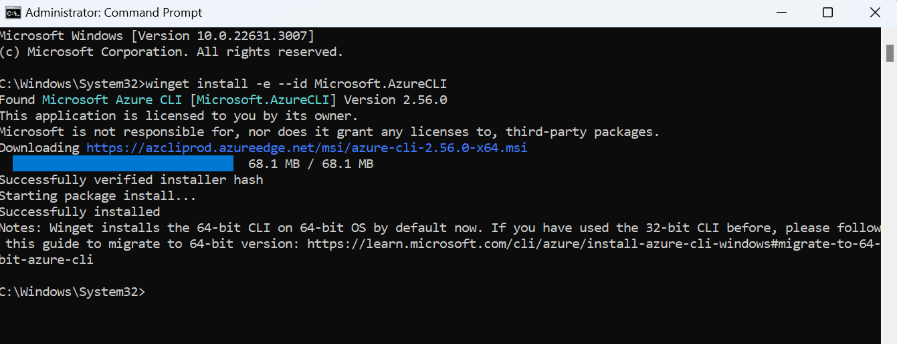
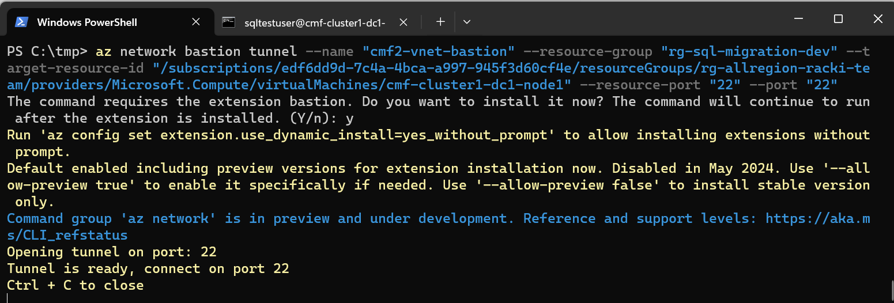
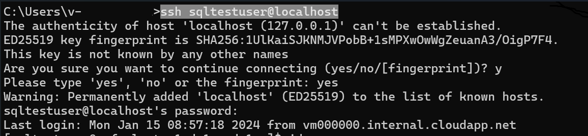

# Setup and connect to the dev box

This document outlines the steps to install Azure CLI on Windows using winget, login to Azure using Azure CLI, create a tunnel using Azure CLI and Bastion host, and connect to an Azure Linux VM using built-in SSH.

## Prerequisites
1. Windows 10 or Windows 11 with current uptates installed
2. Updated version of Azure CLI
3. Access to the subscription with id `edf6dd9d-7c4a-4bca-a997-945f3d60cf4e` 


###  Install Azure CLI on Windows using winget

1. Open your command prompt as an **Administrator**.
2. Run the following command to install Azure CLI:

```shell
winget install AzureCLI
```
3. Check if the command output contains **Successfully installed** message



## Open the tunnel and login to the dev box using ssh
###  Login to Azure and create tunnel

1. Open your command prompt or PowerShell.
2. Run the following command to login to Azure:

```shell
az login
```


3. Create a tunnel running following command:

```shell
az network bastion tunnel --name "cmf2-vnet-bastion" --resource-group "rg-sql-migration-dev" --target-resource-id "/subscriptions/edf6dd9d-7c4a-4bca-a997-945f3d60cf4e/resourceGroups/rg-allregion-racki-team/providers/Microsoft.Compute/virtualMachines/cmf-cluster1-dc1-node1" --resource-port "22" --port "22"
```

Wait for the following message and keep command prompt running: 
```
Opening tunnel on port: 22
Tunnel is ready, connect on port 22
Ctrl + C to close
```



## Connect to the Azure Linux VM using built-in SSH

1. Open separate command propmt.
2. Run the following command, replacing <vm username>  with your VM’s username.:
```shell
ssh <vm username>@localhost
```
3. Type `yes` if following message is shown after ssh command:

```
The authenticity of host 'localhost (127.0.0.1)' can't be established.
<id> key fingerprint is SHA256:<sha key>.
This key is not known by any other names
Are you sure you want to continue connecting (yes/no/[fingerprint])? y
```


## Troubleshooting

If your default tenant is different than vm tenant, run the `az login` command using `--tenant` parameter

```shell
az login --tenant <target tenant name> --allow-no-subscriptions
```

If your default subscription is different than specified in prerequisites, run the `az login` command using 

```shell
az account set --subscription <name or id>
```
